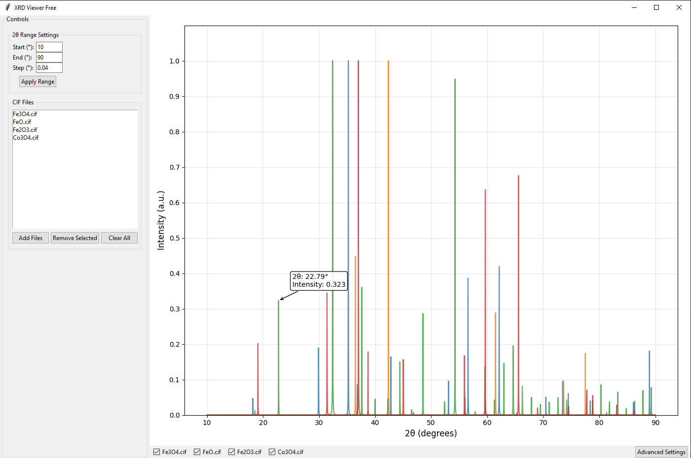

# XRD Viewer Free

A Python-based GUI application for visualizing and analyzing X-ray diffraction (XRD) patterns from CIF files, with advanced features for accurate pattern calculation and 3D structure visualization (soon).



## Features

- **Accurate XRD Pattern Calculation**
  - Uses pymatgen's XRDCalculator for precise pattern generation
  - Implements pseudo-Voigt peak profiles
  - Handles structure factors and anisotropic effects

- **Interactive Visualization**
  - Multiple pattern overlay with toggle controls
  - Adjustable 2θ range and step size
  - Real-time pattern updates

- **Advanced Features**
  - Customizable experimental parameters
  - Integrated 3D structure visualization (soon)
  - Framework for Rietveld refinement integration

- **File Management**
  - Load multiple CIF files
  - Individual pattern visibility control
  - Clear and remove file options

## Requirements

- Python 3.7+
- Required Packages:
  ```bash
  pip install pymatgen matplotlib numpy